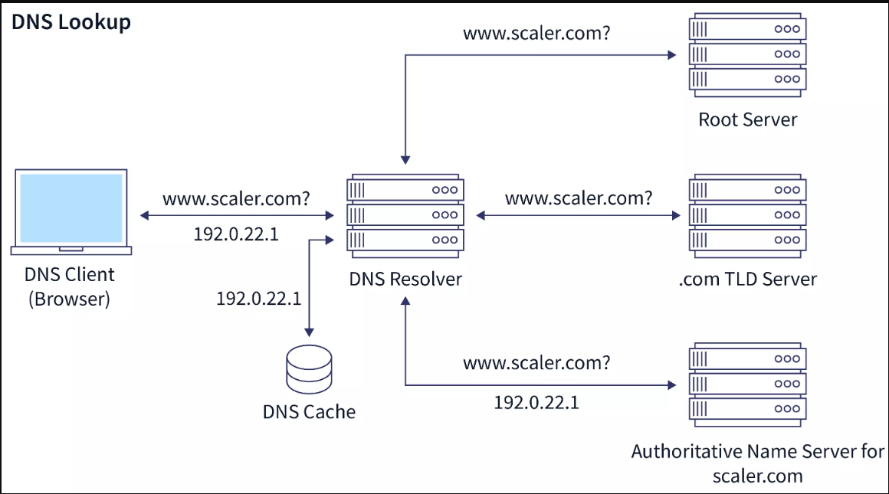

# 💻💻💻 Networking Notes  
-**CDN** (Content delivery network) : server which serve static data like images and videos. CDN caches copies of your content across multiple servers worldwide.  
When a user requests your site, the CDN serves it from the server closest to them, reducing latency and improving speed.

-**Cache**: Its temporary data center use store static data  
-**Edge location** : location where cache dadte is stored

**Internet Protocal** -  
  There is total 4.3 billion ipv4 address. Ipv4 is limited and not enough for all the devices thats why we have ipv6 address.  
  ipv6 128 bits alphanumeric number consist of Eight groups of four hexadecimal digits separated by colons.  

  ipv6 is a bit complex and difficul to rememeber. Hence they find a way to to continue using ipv4 address.  
  This is how concept of subneting is intoducesd.  
  
**Subnet:**  Dividing large network into small network  

## CIDR (Classless Inter-Domain Routing):

its a compact way to write IP address ranges and their network masks.  
232-n
if n=4 the CIDR notation will be /4
if n=28 the cidr notation will be /28, total number of ip address will be 16  
    Network address : first ip address in that subnet  
    Broadcast address : last ip address in that subnet  
    only 14 ip address will be available for use for VIDR notation /28  
e.g: for subnet 192.168.1.0/28  
* Network ip address : 192.168.1.0  
* broadcast ip address :192.168.1.15  
* First Usable IP:192.168.1.1  
* Last Usable IP : 192.168.1.14

## 🤝 OSI(open system interconnection) Model:  
1. **Physical layer**  
   e.g :  wifi, repeater, hub, lan etc.
2. **data link layer**  
   e.g : MAc address, bridgge, NIC
3. **Network layer**  
   work on IP protocal e.g Router
4. **Transport layer**  
    TCP and UDP protocal, data transfer in packets
   TCP use three handshake model to tranfer the data.
     1. client sync with server
     2. server acknowledge the sync
     3. server send scknowledgement to the client
    SSH use TCP in background to connect the server securily
        
6. **Session layer**
7. **Presentation layer**
8. **Application Layer**
    
   ---
## DNS(Domain name System):
Step 01 — Browser requests a URL and the local cache is checked first  
Step 02 — If not in cache, the hosts file is checked  
Step 03 — If still not found, the query goes to the ISP's DNS Resolver  
Step 04 — The resolver does a recursive search: Root Server → TLD Server → Authoritative Name Server, collecting the real IP  
Step 05 — The DNS Resolver returns the final IP to the computer  

1. User Request  
When we type a domain name like https://www.geeksforgeeks.org/ into our browser, our computer starts the process of finding the corresponding IP address needed to connect to the website.

2. Check Local Cache  
The first place our system looks is in its local cache, which may include:  
. Browser Cache  
. Operating System (OS) Cache  
. Router Cache

3. Check Host Files  
If the IP address is not in the local cache, the system may check host files, which are manually configured mappings of domain names to IP addresses. This is rare in modern systems, but it might still be used for certain network configurations.

4. Query DNS Resolver  
If no IP address is found locally, the request is sent to a DNS Resolver. The Resolver is a server provided by our Internet Service Provider (ISP) or a public DNS service like Google DNS (8.8.8.8) or Cloudflare (1.1.1.1). The Resolver acts as the intermediary that communicates with various DNS servers to find the IP address.

5. Contact the Root Server  
Resolver first contacts the Root DNS Server which is the starting point for DNS lookups. The Root server doesn’t know the exact IP address of geeksforgeeks.org but directs the query to the Top-Level Domain (TLD) Server responsible for .org.

6. Query TLD Server  
Resolver sends the query to the TLD Server for .org domains. The TLD server handles domain names ending in .org and knows where to find the authoritative nameserver for geeksforgeeks.org.

7. Query the Authoritative Server  
The Resolver then queries the authoritative nameserver for geeksforgeeks.org. This server is responsible for storing DNS records for the domain, including the mapping of the domain name to its IP address.

8. Retrieve the IP Address  
Authoritative nameserver responds to the Resolver with the exact IP address (e.g., 192.0.2.1) for geeksforgeeks.org.

9. Return IP Address to Computer  
Resolver receives the IP address from the authoritative nameserver and sends it back to our computer. At this point, our computer knows how to connect to the website.
   

  
